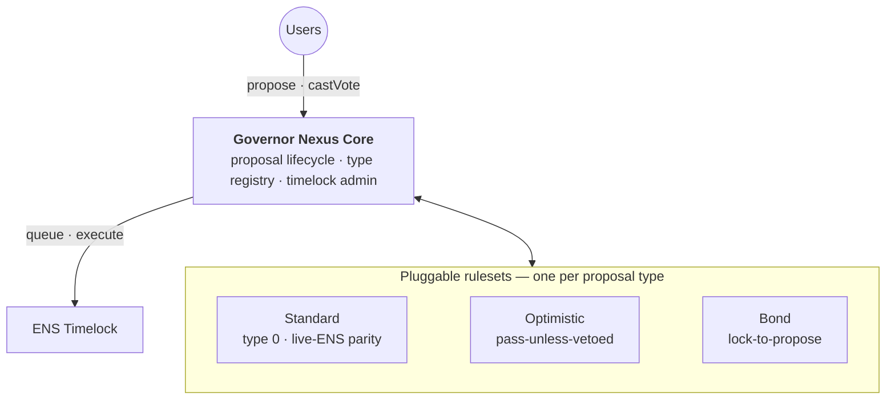

# nexus

Production implementation of **Governor Nexus** — blockful's modular security upgrade
for ENS governance ([RFC](https://discuss.ens.domains/t/rfc-governor-nexus-modular-security-upgrade-for-ens-governance/21942)).

Governor Nexus is a modular governance framework that modernizes the ENS Governor while
preserving full compatibility with the existing Timelock contract. It combines security
hardening, improved operational UX for delegates, and a ruleset architecture that lets
different proposal classes follow different approval logic — reducing governance attack
surface now while making future governance evolution safer and easier.

In code terms: `GovernorNexus` replaces the stock governor's baked-in
settings/counting/quorum with a vote-governed registry of proposal types, each
dispatching vote-counting to a pluggable external `IRuleset`, and layers the security
mechanisms on the core — **mutable votes**, the **anti-snipe late-vote extension**, a
per-proposer **spam limit**, a hardened **cancellation policy**, **batch voting**.
Behavioral parity against the live deployed ENS governor is proven on a mainnet fork;
deliberate divergences are pinned as such by the fork suite.

## Architecture

Governor Nexus uses a modular router architecture:



**Governor Nexus Core responsibilities:**

- Owns the proposal lifecycle and the Timelock admin rights — the existing ENS Timelock
  is kept as-is
- Maintains the vote-governed, append-only proposal-type registry; every proposal is
  pinned to exactly one type at creation, for its lifetime
- Dispatches counting, quorum/success checks, and propose-time validation to the pinned
  ruleset — the core never counts votes itself

**Ruleset responsibilities:**

- Define quorum, approval thresholds, and type-specific counting logic
- Own the vote buckets and per-voter receipts — every ruleset inherits the
  `RulesetCounting` base (Bravo buckets, mutable votes)
- Stay individually swappable through governance: each ruleset is an immutable,
  single-purpose contract; the DAO evolves by registering new types, never by mutating
  live ones

**Proposal types** shipped in this repo (others can be introduced later through
governance):

| Proposal type | Condition to propose | Approval | Quorum |
|---|---|---|---|
| Standard (type 0, default) | Voting power ≥ proposal threshold | Simple majority | Fractional, 1% of supply — live-ENS parity |
| Optimistic | Allowlisted proposer + allowlisted actions | Passes unless Against reaches the veto threshold | None |
| Bond | Lock `bondAmount` of ENS — no voting-power gate | Simple majority + spam-slash predicate on defeat | Fractional, 1% of supply |

Registry mechanics, precisely:

- **Each type pins an external `IRuleset`** plus its own voting delay, voting period, and
  proposal threshold. Once registered, a type's ruleset and parameters never change — only
  its `active` flag and the registry's default pointer can move, both gated behind
  governance.
- **The per-proposal type pin is read transiently** (EIP-1153) only while the stock
  proposal-creation body runs, so the type-scoped delay/period never leak into externally
  observable state — safe because that body makes no state-committing external call while
  the context is set (its only external dispatch, the duplicate-proposal check, reverts
  unconditionally), so no reentrant reader can ever observe the typed values.
- **Every counting read dispatches to the pinned ruleset** — `countVote`, `quorumReached`,
  `voteSucceeded`, and `hasVoted` — so the DAO swaps counting per type without ever
  touching the governor.
- **`StandardRuleset` is the bootstrap ruleset** (registered as type 0, the initial
  default): it reproduces the live ENS governor's Bravo-style vote buckets
  (Against/For/Abstain) and fractional quorum exactly.
- **The governor stays a drop-in `IGovernor`:** untyped surface — `votingDelay()`,
  `votingPeriod()`, `quorum()`, `COUNTING_MODE()` — reads the current default type's row,
  so the stock interface holds even though the real behavior is per-type.

## Mutable votes

While a proposal is open, casting again replaces your standing vote. This is a deliberate
behavioral divergence from the live ENS governor, which rejects a second vote; the fork
suite pins it as such.

Counting mechanics live in `RulesetCounting`, the abstract base every ruleset inherits: it
owns the vote buckets and a per-voter receipt (`hasVoted`, `support`, `weight`), and it makes
re-voting a **replace** — `countVote` debits the receipt's recorded weight from its recorded
bucket before crediting the new vote, in the same call, so a voter's weight is never
double-counted nor transiently missing. `hasVoted` therefore means "has a standing vote" and
stays true across re-votes.

Two consequences follow for integrators:

- **Indexers:** a re-vote emits another stock `VoteCast` for the same (proposal, voter); the
  **latest one in log order is canonical** — earlier ones are superseded, not additive.
  `voteReceipt(proposalId, voter)` returns the current standing vote directly.
- **Tallies are non-monotonic:** quorum and success can flip in *both* directions while voting
  is open, so no consumer can arm one-shot state on a tally-crossing event — an attacker could
  otherwise cross a threshold early, re-vote back below it, and burn a once-only trigger before
  the crossing that matters. Mechanisms needing finality (e.g. the anti-snipe extension below)
  evaluate the outcome at the deadline, bar re-votes inside their own window, or gate
  early finality.
- **Gasless relayers:** a direct `castVote*` spends the voter's EIP-712 nonce, so voting directly
  invalidates any of that voter's outstanding signed ballots (across all open proposals — the
  nonce is per-account). A stale pre-signed ballot therefore cannot override a later direct vote
  under mutable votes; a relayer needs a fresh signature once the voter acts directly.

## Anti-snipe late-vote extension

If a proposal flips from failing to passing inside the final 24h (`extensionWindow`), voting
is extended once by 48h (`extensionDuration`) — measured from the **original** deadline, so
flip timing buys no extra calendar time. Both params are constructor immutables in clock
units; the mechanism lives in the core and reads the pinned ruleset's
`quorumReached && voteSucceeded`, so every proposal type gets it under its own semantics.

The trigger is a **window low-water mark**, not a one-shot slot: the extension fires iff the
proposal was observed failing at any point inside the window AND would pass at the original
deadline. Nothing is armed on a tally crossing — the pattern the counting layer's
non-monotonicity note forbids — so re-vote oscillation cannot burn the protection; the only
way to avoid the extension is holding the proposal visibly passing for the entire final
window, which is itself the intended response time. Voting stays free in both directions
during the extension; the tally at the extended deadline decides.

Integrator notes:

- **`proposalDeadline` is authoritative** and grows lazily: it returns the original deadline
  until that deadline passes, then the extended one if the extension holds. No tentative
  extension is ever shown mid-window (a flip can still revert before the deadline).
- **`ProposalExtended(proposalId, extendedDeadline)`** (OZ `GovernorPreventLateQuorum` ABI)
  is emitted by the first cast after the original deadline. If nobody votes during the
  extension the event never fires — the views (or replaying `VoteCast` tallies against the
  immutable params) remain the source of truth.

## Batch voting

`castVoteWithReasonAndParamsBatch` casts votes on several proposals in one transaction,
all-or-nothing. A batch is a direct cast: it spends the voter's nonce once, so — like any
direct vote — it invalidates the voter's outstanding signed ballots across all open
proposals. Duplicate ids inside a batch are ordinary re-votes, last-wins. Empty
`reasons[i]`/`params[i]` entries mean "none" — OZ emits `VoteCast` for empty params and
`VoteCastWithParams` otherwise.

Batching is an explicit function rather than OZ's `Multicall` mixin: the governor's payable
surface (`execute`/`relay`/`receive`) is exactly what makes Multicall the msg.value-reuse
bug class, and an explicit signature keeps the batch semantics (single nonce spend,
all-or-nothing) auditable in one place.

## Spam limit

`GovernorNexus` caps how many proposals a single proposer can hold concurrently live:

- **Live means `Pending` or `Active`, nothing else:** a proposal that already survived its
  vote (`Queued`) does not occupy a slot, and one that's `Canceled`/`Defeated`/`Executed`
  frees its slot immediately.
- **A concurrency cap, not a rate limit** — it bounds a key's in-flight
  governance-attention footprint, not how often it can propose over time.
- **Enforcement is lazy:** on each propose, the governor drops any of the proposer's
  tracked ids that left the live set, then reverts if the survivors already fill the cap;
  a proposal is added to the tracked set only after that check passes.
- **Governance-settable** (`setMaxActiveProposals`) within
  `1..MAX_ACTIVE_PROPOSALS_CEILING` (10) — zero is rejected because it would revert every
  propose, including the governance proposal needed to raise it back — and deploys at 2
  for the ENS migration (`ENSParams.MAX_ACTIVE_PROPOSALS`).
- **Per-address**, and, like `proposalThreshold`, it does not resist an attacker willing
  to split voting power across multiple addresses — accepted, consistent with every
  per-address proposal cap in production governance (Bravo/Nouns/Uniswap all share this
  property).
- **The liveness probe (`_isLive`) is deliberately ruleset-free.** Because the lazy prune
  runs on *every* propose, a probe that dispatched to the pinned ruleset would let a
  ruleset with poisoned (reverting) views brick its own proposer's next propose. So the
  probe reads only core storage: within the original deadline it consults `state()` (which
  resolves purely from `Pending`/`Active` there), and past the original deadline it decides
  from the late-flip stage alone — a `None` stage can never extend, so the id is dead;
  otherwise the id may still sit in its one-shot extension window and is treated as live
  until `originalDeadline + extensionDuration`. It never calls `_wouldPass` (the only
  ruleset-dependent path). The cost is a deliberate over-approximation: a `FailingObserved`
  id that ends up failing holds its slot up to `extensionDuration` longer than strictly
  necessary, because its true deadline can only be known by asking the ruleset the probe
  must not call.

## Optimistic ruleset

`OptimisticRuleset` is a second production ruleset: proposals under its type **pass by
default** — there is no quorum, and the vote fails only if the Against bucket reaches an
absolute veto threshold (500k ENS at the intended ENS registration) by the deadline. A
proposal nobody voted on executes. Because the "voters judge the content" filter is gone,
safety moves to propose time — the validator enforces that:

- the **proposer is allowlisted**;
- every **`(target, selector)` action is allowlisted**;
- no action carries **ETH value**;
- every action has at least a 4-byte selector — checking the three array lengths itself,
  before any indexing, with no reliance on downstream validation.

The ruleset deploys with **empty allowlists**: day one the optimistic path can do nothing,
and the DAO votes entries in through standard full-quorum governance (the setters answer
only to the timelock). The action setter permanently refuses the governance core as a
target — the governor, the timelock, and the ruleset itself — so a zero-vote proposal can
never reconfigure the system that created it.

The propose-time hook is the core's one addition: a ruleset advertising
`IProposalValidator` via ERC165 has `validateProposal(proposer, targets, values,
calldatas)` called before the proposal is created, and a revert blocks creation.
Detection happens once, at `registerType`, pinned as `hasProposalValidation` on the content-immutable
type line and never re-queried — types whose rulesets don't opt in keep a byte-identical
propose path. A misbehaving validator can only brick proposing its own type (a revert
*is* the gate's behavior); other types and the default path never reach it.

Two properties are deliberate and documented rather than solved in code:

- **Selector allowlisting bounds *which function* a proposal may call, never what that
  call semantically does** — allowlisting a token's `approve` is allowlisting the spend.
  Curating entries down to genuinely low-risk operations is the DAO's responsibility.
- **The veto is withdrawable** — under mutable votes, a vetoer re-voting For/Abstain
  drains the Against bucket, so the outcome is non-monotonic in both directions. The
  snipe this enables (withdraw a standing veto at the last block) is exactly the
  failing→passing flip the anti-snipe extension fires on: the community gets the full
  extension window to re-assemble the veto.

`COUNTING_MODE` is `"support=bravo&quorum=against,for,abstain"`, verbatim the string
Optimism's audited optimistic module advertises, so existing indexer support carries over.

## Cancellation

Stock OZ lets only the proposer cancel, and only before voting starts. `GovernorNexus`
replaces that (via the `_validateCancel` hook — no fork): **cancellation is possible only
while the proposal is `Pending` or `Active`** — once the voting process finishes, no one
can cancel, in any state — and within that window two rules apply:

- **Self-cancel:** the proposer can always cancel their own proposal, recovering from
  mistakes without burning a full voting cycle.
- **Continuous threshold:** the propose-time threshold is a standing obligation. If the
  proposer's voting power drops below the **pinned type's** `proposalThreshold`, `cancel()`
  becomes permissionless — anyone can kill the proposal while it is still votable. Types
  registered with a zero threshold (future bond-style or allowlisted paths) never expose
  this rule.

The voting-power read is `getVotes(proposer, clock() - 1)` — byte-for-byte the propose-time
check, so "cancellable by anyone" is exactly "could not create this proposal now". The
clause structure and the prior-block read follow Compound Governor Bravo's production
semantics (shipped since 2021); the window is deliberately narrower than Bravo's, which
keeps below-threshold cancel open through `Succeeded`/`Queued` — here a proposal that
survived its vote is settled, and post-vote outcomes (including a proposer who dips after
voting ends) belong to execution or to a fresh governance action, not to `cancel()`.
Design consequences, accepted deliberately:

- **Single-block dips count.** A proposer below threshold for one block (a re-delegation in
  transit, a transfer-and-return) leaves the proposal cancellable at the next block, even
  if their power is already back. Griefing-only (nothing is stolen; the proposer can
  re-propose) and proposer-controlled (keeping the threshold backed is their obligation).
  No hysteresis and no guardian-exemption role, matching the no-privileged-actors design.
- **No post-vote backstop.** Bravo's wide window lets anyone cancel a queued proposal whose
  proposer drained their power during the timelock delay; this design trades that backstop
  away for the guarantee that a passed proposal cannot be griefed out of the queue. The
  timelock delay remains the DAO's reaction window through its own governance paths.
- **The threshold is the pinned one.** The check reads the proposal's registered type row —
  content-immutable — never live config and never the ruleset, so a later governance change
  (new types, moved default) cannot retroactively change any live proposal's cancel
  exposure, and a malicious ruleset has no say in cancel authorization.

## Bond ruleset

`BondRuleset` is a lock-to-propose proposal type: it registers with `proposalThreshold =
0`, so anyone can propose through it by locking `bondAmount` of ENS — no voting-power gate
at all. Counting adds a fourth ballot option to the Bravo triple, `AgainstAndSlash`, cast
through the same vote as any other option. The bond is
forfeited to the DAO treasury exactly when the vote judges the proposal to be spam, per the
predicate the DAO ratified on Snapshot:

```
slashed ⟺ (Against + AgainstAndSlash > For) ∧ (AgainstAndSlash′ > Against′)
```

where `′` excludes the proposer's own standing vote from the second comparison only — the
first (defeat) comparison stays the raw buckets. Without the exclusion, a proposer could
cast a plain `Against` vote on their own proposal to dilute the slash bucket's plurality
and dodge forfeiture while still losing the vote (the anti-dilution rule); excluding their receipt from that
one comparison closes it without touching the DAO-ratified rule itself. A `Defeated`
outcome driven by quorum failure, or a tie (`For == rejections`), never slashes — only a
clear rejection with slash-plurality does.

Cancellation interacts with the bond through the same partition the cancellation policy
draws between `Pending` and `Active`:

| Path | Outcome |
|---|---|
| Self-cancel while `Pending` | Full refund — no vote existed yet, nothing to evade |
| Self-cancel while `Active` | Full forfeit — once voting is live, exiting costs as much as losing it |
| Canceled directly on the timelock (security-council veto) | Full forfeit — the ratified default |

`resolveBond` is permissionless and one-shot, and only ever pays out in a terminal state —
`Executed`, `Defeated`, or `Canceled`. It reverts in `Succeeded`/`Queued`: those states sit
inside the security council's timelock-veto window, and an early refund there would let a
proposer pull their bond out from under a veto before the council acts. A refund on a
passed proposal is available the moment it executes, and execution is permissionless.

Every BondRuleset parameter — `token`, `quorumNumerator`, `bondAmount`, `treasury` — is
`immutable`, with no setters, matching every other ruleset in this repo. 1,000 ENS is
the ratified initial value ("1,000 ENS is the right initial value"). The DAO
re-prices the bond, or moves the treasury, by deploying a new `BondRuleset` and calling
`registerType` — never by adding a setter to this one; proposals already locked against the
old ruleset keep resolving against it.

Accepted residuals:

- **Whale force-slash.** A large holder can vote `AgainstAndSlash` on an honestly-defeated
  proposal and confiscate the bond at zero marginal cost of their own; the predicate's
  defeat-plus-plurality bar bounds this but doesn't eliminate it. This is the ratified
  mandate itself, not an implementation gap.
- **Sybil vs. the bond.** Splitting proposals across multiple identities doesn't reduce
  total cost the way it can against a voting-power threshold: each identity still locks a
  full `bondAmount`, so the bond scales spam cost linearly with proposal count regardless
  of how it's split across addresses.
- **Gated-ruleset trust.** A ruleset that implements the propose-time hook is fully trusted
  by governance — registering it is a governance action, and it already controls its type's
  counting, quorum, and success. Its hook is the first external call in the governor's
  propose path, so a *malicious* gated ruleset could reenter and exceed its own
  per-proposer active-proposal cap (never a victim's — the reentrant proposer is the ruleset
  itself). No reentrancy guard is added: the production `BondRuleset` transfers hook-free
  ENS, and the exposure is bounded to a self-inflicted cap on a governance-approved contract.
- **Bond stranded by an unexecutable-but-approved proposal.** A proposal that passes but
  whose on-chain actions always revert on execution never reaches `Executed` (the timelock
  has no `Expired` state), so it stays in `Queued` and its bond is never released. Accepted:
  it requires the community to approve a proposal with permanently-reverting calldata, and
  the stranded bond is the proposer's own.

## Layout

| Path | What |
|---|---|
| `src/GovernorNexus.sol` | Governor core — proposal-type registry, per-proposal pin, ruleset dispatch |
| `src/GovernorPreventLateFlip.sol` | **Anti-snipe extension**, an abstract Governor module (window low-water mark, lazy deadline extension) — reusable by any OZ v5 governor, hardened for mutable votes |
| `src/interfaces/IRuleset.sol` | Interface a pluggable ruleset implements (counting, quorum, vote success) |
| `src/RulesetCounting.sol` | Counting base every ruleset inherits — Bravo buckets, per-voter receipts, **mutable votes** (a re-vote replaces the standing vote) |
| `src/rulesets/StandardRuleset.sol` | Bootstrap ruleset — live-ENS-parity quorum/success rules on top of the counting base |
| `src/interfaces/IProposalValidator.sol` | Optional ruleset extension — propose-time content-validation hook (carries `descriptionHash`), ERC165-detected at registration; drives the optimistic gate and `BondRuleset`'s bond lock |
| `src/rulesets/OptimisticRuleset.sol` | Optimistic ruleset — pass-unless-vetoed outcome + propose-time proposer/action allowlists |
| `src/rulesets/BondRuleset.sol` | **Lock-to-propose ruleset** — fourth ballot option, bond custody (lock/refund/forfeit), spam-slash predicate |
| `src/ENSParams.sol` | Live ENS addresses + current governor parameters (single source of truth) |
| `script/Deploy.s.sol` | Deploys `StandardRuleset` + `GovernorNexus` (two-contract, CREATE-address-precompute deploy) against the real ENS token + timelock |
| `test/governor/GovernorNexus.registry.t.sol` | Unit suite: type registration, activation, default-pointer moves |
| `test/governor/GovernorNexus.propose.t.sol` | Unit suite: both propose doors, type pinning, per-type parameters |
| `test/governor/GovernorNexus.lifecycle.t.sol` | Unit suite: full propose → vote → queue → execute lifecycle |
| `test/governor/GovernorNexus.adversarial.t.sol` | Unit suite: malicious/misbehaving ruleset blast-radius containment |
| `test/governor/GovernorNexus.spamlimit.t.sol` | Unit suite: per-proposer live-proposal cap |
| `test/governor/GovernorNexus.cancel.t.sol` | Unit suite: cancellation policy — self-cancel + continuous-threshold permissionless cancel |
| `test/governor/GovernorNexus.bond.t.sol` | Unit suite: bond ruleset wired into the governor — lock at propose, cancel-partition resolution |
| `test/rulesets/BondRuleset.t.sol` | Unit suite: bond custody, slash predicate table, cancel partition, constructor guards |
| `test/rulesets/BondRuleset.invariant.t.sol` | Invariant/fuzz suite: bond custody solvency across randomized propose/vote/cancel/resolve sequences |
| `test/rulesets/BondRulesetTestBase.sol` | Shared fixture for the bond suites above |
| `test/governor/GovernorNexusTestBase.sol` | Shared fixture the suites above inherit (deploy wiring + governance-loop helpers) |
| `test/governor/GovernorNexus.lateFlip.t.sol` | Unit + fuzz suite for the late-flip extension: trigger matrix, oscillation/burn attempts, lazy materialization, model-checked fuzz |
| `test/rulesets/RulesetCounting.t.sol` | Unit + fuzz suite for the counting base: re-vote replace mechanics, tally conservation, receipt width guard |
| `test/rulesets/StandardRuleset.t.sol` | Unit suite for the bootstrap ruleset |
| `test/rulesets/OptimisticRuleset.t.sol` | Unit + fuzz suite for the optimistic ruleset: veto boundary, validator rules, allowlist setters |
| `test/governor/GovernorNexus.proposalValidation.t.sol` | Integration suite for the propose-time validation gate (mock validators only): detection/pinning, revert propagation, misbehaving-validator containment |
| `test/governor/GovernorNexus.optimistic.t.sol` | Integration suite for the optimistic type: validation rules through the gate, allowlist governance loop, e2e lifecycle, veto-withdrawal × anti-snipe |
| `test/Deploy.t.sol` | Unit suite for the deploy script |
| `test/mocks/` | `MockENSToken`, `MockGovernor`, `MaliciousRulesets`, `ValidatorRulesets`, `Box` test target |
| `test/fork/` | Mainnet-fork suites: behavioral parity (live governor vs GovernorNexus) + A/B gas benchmark |

## Build & test

```bash
forge build
forge test --no-match-path "test/fork/*"     # unit suite, no network
forge test --match-path "test/fork/*" -vv    # mainnet-fork parity + gas bench
forge coverage --no-match-path "test/fork/*" --report summary
```

Fork tests pin block 25,445,220 and default to a public archive RPC; set
`MAINNET_RPC_URL` for a dedicated endpoint (also the name of the CI secret).

## Nexus vs. the live ENS governor

The live ENS governor is a 2021, OZ-v4, Bravo-style deployment with everything fixed at
deploy time; Governor Nexus rebuilds it on OZ v5.6.1 while keeping its day-to-day
surface — behavioral parity is proven on a mainnet fork against the live bytecode, with
each deliberate divergence pinned by the fork suite. What changes is the risk profile:
the RFC's security assessment under the [Anticapture](https://anticapture.com/ens)
framework places the current setup at **Stage 0**, and the mechanisms below move ENS
governance to **Stage 1**.

| Exposure in the live governor | Severity | Governor Nexus answer |
|---|---|---|
| Proposal spam can force a war of attrition | **Critical** | Per-proposer cap on concurrently live proposals — deploys at 2, governance-settable |
| Insufficient voting delay — the pre-vote coordination window is one block | **Critical** | Voting delay is a per-type registry parameter; the migration raises it by governance, with no code change |
| No continuous threshold enforcement — a proposer can dump their tokens right after submitting | **Critical** | A proposal whose proposer drops below threshold becomes cancellable by anyone while still votable |
| Vote immutability — no correction path if a voting interface is compromised | **Medium** | Mutable votes: casting again replaces the standing vote |
| No late-vote extension — last-minute flips can pass without response time | **Medium** | Anti-snipe extension: a failing→passing flip in the final 24h extends voting by 48h |
| Routine operations require a full governance vote | **Low** | Optimistic pass-unless-vetoed type, gated by proposer/action allowlists |
| Uniform approval thresholds for every proposal class | **Low** | Per-type thresholds and quorum via the ruleset registry |
| High operational friction for delegates under proposal load | QoL | Batch voting — many proposals, one transaction, one nonce spend |
| Proposing requires 100k ENS of voting power, full stop | QoL | Bond ruleset — lock 1,000 ENS instead, slashed only under the DAO-ratified spam predicate |

### Gas benchmarks

What the features above cost per operation: `test/fork/GasBench.t.sol` runs an A/B
benchmark on the same mainnet fork — the live ENS governor (real deployed bytecode, real
token checkpoint history) vs GovernorNexus, both running identical payloads through the
same helpers. Gas is the `gasleft()` delta around the single measured call, excluding
setup/fixture cost. Reference numbers at block 25,445,220 (regenerate with
`forge test --match-contract GasBench -vv`):

| op | live gov | GovernorNexus | delta | attribution |
|---|---:|---:|---:|---|
| propose | 115,052 | 139,441 | +24,389 | Type-pin SSTORE + transient-context writes + the extra `ProposalTypedCreated` event, plus the spam-limit bookkeeping (active-set append + lazy prune) and the propose-time validation hook — partially offset by OZ v5's packed `ProposalCore` beating the live governor's storage layout. |
| castVote | 106,982 | 135,831 | +28,849 | One external CALL into the pinned ruleset's `countVote` (cold account access + its own tally SSTORE), the anti-snipe low-water evaluation around the cast (outcome views call back into the governor and out to the token), and the vote-nonce spend on direct casts. |
| queue | 102,244 | 121,931 | +19,687 | `queue()`'s state-bitmap check re-derives quorum/success by calling out to the ruleset, which itself calls back into the governor (`proposalSnapshot`) and out to the token (`getPastTotalSupply`) — a multi-hop CALL chain the live governor's local tally doesn't pay. |
| execute | 79,188 | 61,606 | -17,582 | Net cheaper; `execute()`'s state check re-runs the same ruleset CALL chain as `queue()`, so the sign flip is attributed to the live governor's own (opaque, bytecode-only) execute-path bookkeeping rather than anything ruleset-side. |
